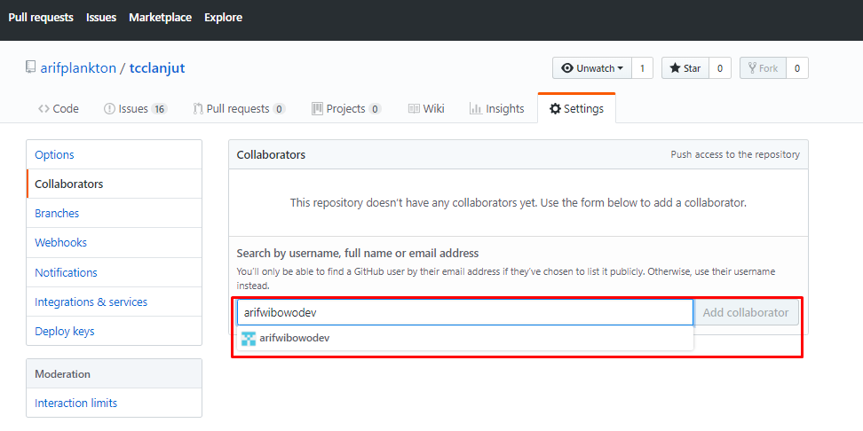

#PULL/MERGER REQUEST

##Langkah-langkahnya

Langkah Kolaborasi di Git

1. Kik pada setting, kemudian pilih collaboration disebelah kiri

 

2. Cari akun Github yang akan diajak kolaborasi 

3. Copy link repro pada Github

4. Buka link tersebut pada akun Github @arifwibowodev 

5. Klik Accept 

6. Repro sudah masuk pada di akun yang lain yaitu @arifwibowodev

