# Buat Dockerfile

1. Kik pada setting, kemudian pilih collaboration disebelah kiri
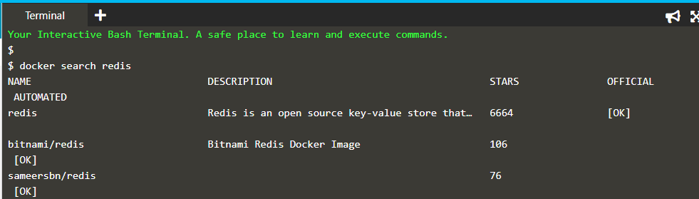 

image Docker mulai dari image dasar. image dasar harus mencakup dependensi platform yang diperlukan oleh aplikasi Anda, misalnya, menginstal JVM atau CLR.

## Tugas
Buat Dockerfile Anda untuk membangun image Anda dengan menyalin konten di bawah ini ke editor.

`FROM nginx:alpine
COPY . /usr/share/nginx/html`

Baris pertama mendefinisikan image dasar kita. Baris kedua menyalin konten direktori saat ini ke lokasi tertentu di dalam wadah.

## Langkah 2 - Bangun Image Docker

Dockerfile digunakan oleh perintah pembangunan Docker CLI. Perintah build mengeksekusi setiap instruksi dalam Dockerfile. Hasilnya adalah image Docker bawaan yang dapat diluncurkan dan menjalankan aplikasi yang dikonfigurasi.

Bangun image HTML statis kami menggunakan perintah build di bawah ini.
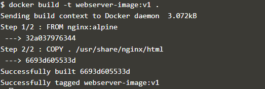 

Anda dapat melihat daftar semua image di host menggunakan `docker image`
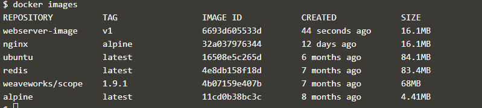 

## Langkah 3 - Jalankan

image yang dibangun dapat diluncurkan secara konsisten ke image Docker lainnya. Ketika sebuah wadah diluncurkan, itu di-sandbox dari proses dan jaringan lain di host. Saat memulai sebuah wadah, Anda harus memberinya izin dan akses ke apa yang diperlukannya.

Luncurkan image  yang baru dibangun dengan memberikan nama dan tag yang ramah. Karena ini adalah server web, ikat port 80 ke host kami menggunakan parameter -p.
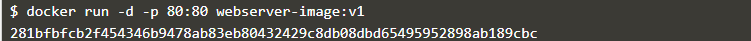 

hasil  port 80 melalui `curl docker`
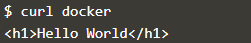 

Untuk merender permintaan di browser gunakan tautan berikut

https://2886795303-80-ollie02.environments.katacoda.com/

Anda sekarang memiliki situs web HTML statis yang dilayani oleh Nginx.

## Langkah 1 - Image Dasar

Semua image Docker dimulai dari image dasar.

### Membuat Dockerfile
Baris pertama Dockerfile harus

## Langkah 2 - Menjalankan Perintah

Dengan image dasar ditentukan, kita perlu menjalankan berbagai perintah untuk mengkonfigurasi image kita. Ada banyak perintah untuk membantu ini, perintah utama keduanya adalah COPY dan RUN.

## Langkah 3 - Mengekspos Port
Dengan file-file kami disalin ke image kami dan setiap dependensi diunduh, Anda perlu menentukan aplikasi port mana yang harus dapat diakses.

Menggunakan perintah EXPOSE <port> Anda memberi tahu Docker port mana yang harus dibuka dan juga dapat diikat. Anda dapat menentukan banyak port pada perintah tunggal, misalnya, EXPOSE 80 433 atau EXPOSE 7000-8000

## Langkah 4 - Perintah Default
Dengan image Docker dikonfigurasi dan telah menentukan port mana yang ingin diakses, kita sekarang perlu mendefinisikan perintah yang meluncurkan aplikasi.

Garis CMD di Dockerfile mendefinisikan perintah default untuk dijalankan ketika sebuah wadah diluncurkan. Jika perintah memerlukan argumen maka disarankan untuk menggunakan array, misalnya ["cmd", "-a", "nilai arga", "-b", "argb-value"], yang akan digabungkan bersama dan perintah cmd -a "arga value" -b argb-value akan dijalankan.

## Langkah 5 - Membangun Wadah
Setelah menulis Dockerfile Anda, Anda perlu menggunakan buruh pelabuhan untuk mengubahnya menjadi image.

Untuk melihat image gunakan perintah `docker images`
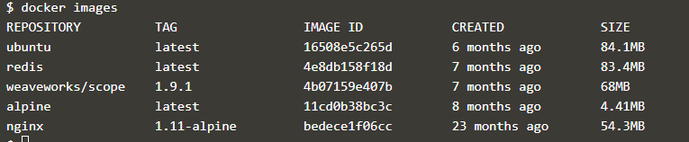 

## angkah 6 - Meluncurkan Image Baru
Dengan image yang berhasil dibuat, Anda sekarang dapat meluncurkan wadah dengan cara yang sama seperti yang kami jelaskan dalam skenario pertama.

Untuk mengakses server web yang diluncurkan melalui buruh pelabuhan nama host. Setelah meluncurkan wadah, perintahnya `curl -i http://docker`
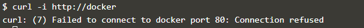 

Untuk memeriksa wadah berjalan menggunakan menggunakan perintah `docker ps`
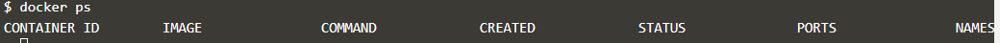 

## Langkah 1 - Image Dasar
Seperti yang jelaskan dalam skenario sebelumnya, semua image dimulai dengan image dasar, idealnya sedekat mungkin dengan konfigurasi yang di inginkan. Node.js memiliki image pre-built yang tersedia dengan tag untuk setiap versi yang dirilis.

## angkah 2 - Instal NPM
Pada set sebelumnya, mengkonfigurasi fondasi konfigurasi kami dan bagaimana kami ingin aplikasi tersebut digunakan. Tahap selanjutnya adalah menginstal dependensi yang diperlukan untuk menjalankan aplikasi. Untuk Node.js ini berarti menjalankan instalasi NPM.

## Tambahkan Baris Dockerfile
Dua baris berikut ini diperlukan agar Dockerfile dapat menjalankan instalasi npm.
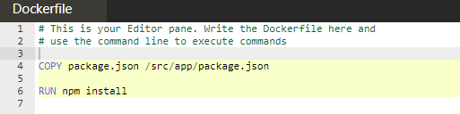

## Langkah 3 - Mengkonfigurasi Aplikasi
Setelah menginstal dependensi kita menyalin sisa kode sumber aplikasi. Memisahkan instalasi dependensi dan menyalin kode sumber memungkinkan untuk menggunakan cache saat diperlukan.

## Langkah 4 - Membangun & Meluncurkan Kontainer
Untuk meluncurkan aplikasi di dalam wadah, harus terlebih dahulu membuat image, dengan perintah `docker build -t my-nodejs-app`
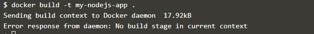

Perintah untuk meluncurkan image yang dibangun adalah `docker run -d --name my-running-app 3000 my-nodejs-app`
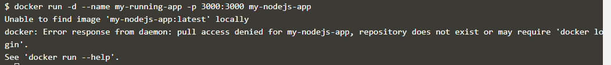

menguji wadah dapat diakses menggunakan curl. Jika aplikasi merespons maka Anda tahu bahwa semuanya telah dimulai dengan benar, dengan perintah `curl http://docker:3000`
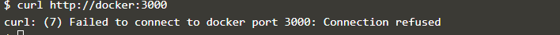

## Langkah 5 - Variabel Lingkungan
image Docker harus dirancang agar dapat ditransfer dari satu lingkungan ke lingkungan lainnya tanpa membuat perubahan apa pun atau perlu dibangun kembali. Dengan mengikuti pola ini Anda dapat yakin bahwa jika itu bekerja di satu lingkungan, seperti pementasan, maka itu akan bekerja di yang lain, seperti produksi.

Menggunakan opsi -e, dapat mengatur nama dan nilai sebagai -e NODE_ENV = produksi

contoh dengan perintah `docker run -d --name my-producion-running-app -e NODE_ENV=production -p 3000:3000 my-nodejs-app`
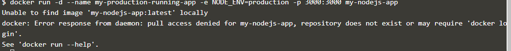

## Membangun & Meluncurkan Kontainer
Dockerfile dari langkah sebelumnya telah dibuat . Membangun image berdasarkan file buruh pelabuhan `OnBuild` sama dengan sebelumnya. Perintah `OnBuild` akan dieksekusi seolah-olah mereka berada di Dockerfile dasar.

Perintah untuk membangun
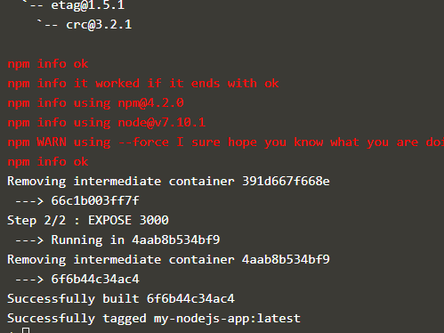

Perintah untuk meluncurkan image yang dibangun adalah
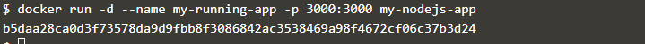

### Wadah pengujian
Menguji wadah dapat diakses menggunakan `curl`. Jika aplikasi merespons ketika Anda tahu bahwa semuanya telah dimulai dengan benar.
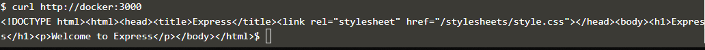

### Docker Abaikan
Untuk mencegah file sensitif atau direktori dimasukkan secara tidak sengaja dalam image, Anda dapat menambahkan file bernama .dockerignore.
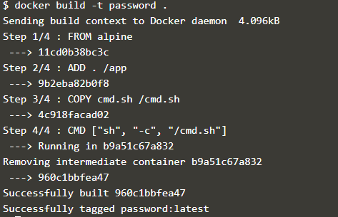
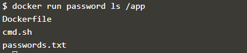

### Abaikan File
Perintah berikut akan menyertakan kata sandi.txt dalam file .dockerignore
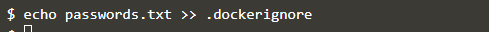

Bangun image, karena file Docker Abaikan tidak boleh menyertakan file kata sandi.
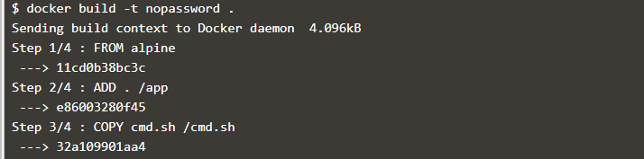
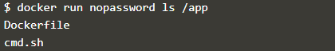
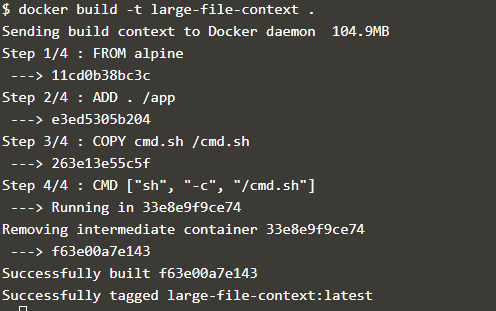

