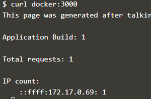

# Komunikasi Antar KOntainer

## Langkah 1 - Mulai Redis
Skenario yang paling umum untuk menghubungkan ke wadah adalah aplikasi yang menghubungkan ke penyimpanan data. 

### Mulai Penyimpanan Data
Jalankan server redis dengan nama ramah redis-server yang akan kita sambungkan pada langkah berikutnya. Ini akan menjadi wadah sumber.

## Langkah 2 - Buat Tautan
Untuk menghubungkan ke wadah sumber, Anda menggunakan opsi --link <container-name | id>: <alias> saat meluncurkan wadah baru. Nama kontainer merujuk ke sumber kontainer yang kami tentukan di langkah sebelumnya sementara alias mendefinisikan nama host yang ramah.

Anda dapat menampilkan semua variabel lingkungan dengan perintah env. Sebagai contoh:

Kedua, Docker akan memperbarui file HOSTS wadah dengan entri untuk wadah sumber dengan tiga nama, asli, alias dan hash-id. Anda dapat menampilkan entri host kontainer menggunakan cat / etc / hosts

Dengan tautan yang dibuat, dapat melakukan ping wadah sumber dengan cara yang sama seolah-olah itu server yang berjalan di jaringan Anda.

## Langkah 3 - Sambungkan Ke Aplikasi
Dengan tautan yang dibuat, aplikasi dapat terhubung dan berkomunikasi dengan wadah sumber dengan cara biasa, terlepas dari kenyataan bahwa kedua layanan berjalan dalam wadah.

Mengirim permintaan HTTP ke aplikasi akan menyimpan permintaan di Redis dan mengembalikan hitungan.

## Langkah 4 - Hubungkan ke Redis CLI
Dengan cara yang sama, Anda dapat menghubungkan wadah sumber ke aplikasi, Anda juga dapat menghubungkannya dengan alat CLI mereka sendiri.
### Meluncurkan Redis CLI
Perintah di bawah ini akan meluncurkan sebuah instance dari alat Redis-cli dan terhubung ke server redis melalui aliasnya.

### Perintah Penerbitan
Perintah KEYS * akan menampilkan konten yang disimpan saat ini dalam wadah sumber redis.
Ketik QUIT untuk keluar dari CLI.

# Docker  Network
## Langkah 1 - Buat Jaringan
Langkah pertama adalah membuat jaringan menggunakan CLI. Jaringan ini akan memungkinkan  untuk melampirkan banyak wadah yang dapat saling menemukan.

### Buat Jaringan
Untuk memulai, kami membuat jaringan dengan nama yang telah ditentukan sebelumnya.

### Sambungkan ke Jaringan
Saat kami meluncurkan kontainer baru, dapat menggunakan atribut --net untuk menetapkan jaringan mana yang harus dihubungkan.

## Langkah 2 - Komunikasi Jaringan
Tidak seperti menggunakan tautan, jaringan buruh pelabuhan berperilaku seperti jaringan tradisional tempat simpul dapat dilampirkan / dilepaskan.

Cara wadah dapat berkomunikasi melalui Server DNS Tertanam di Docker. Server DNS ini ditugaskan untuk semua kontainer melalui `IP 127.0.0.11` dan diatur dalam file resolv.conf.

Ketika wadah mencoba mengakses wadah lain melalui nama yang terkenal, seperti Redis, server DNS akan mengembalikan alamat IP wadah yang benar.

## Hubungkan Dua Kontainer
Docker mendukung beberapa jaringan dan wadah yang terhubung ke lebih dari satu jaringan sekaligus.

membuat jaringan baru dengan cara yang sama.

Saat menggunakan perintah hubungkan, dimungkinkan untuk melampirkan wadah yang ada ke jaringan.

Ketika kami meluncurkan server web, mengingat itu terlampir pada jaringan yang sama itu akan dapat berkomunikasi dengan instance Redis.

Untuk mengujinya dengan `curl docker:3000`

## Langkah 4 - Buat Alias
Tautan masih didukung saat menggunakan jaringan buruh pelabuhan dan menyediakan cara untuk mendefinisikan Alias dengan nama wadah.

### Hubungkan Kontainer dengan Alias
Perintah berikut akan menghubungkan instance Redis ke jaringan frontend dengan alias dari db.

Ketika kontainer mencoba mengakses layanan melalui nama db, mereka akan diberi alamat IP dari kontainer Redis.

## Langkah 5 - Putuskan Kontainer
Dengan jaringan yang dibuat,dapat menggunakan CLI untuk menjelajahi detailnya.

Perintah berikut akan mencantumkan semua jaringan di host.

kemudian dapat menjelajahi jaringan untuk melihat wadah mana yang dilampirkan dan alamat IP.

Perintah berikut ini memutus wadah redis dari jaringan frontend.

