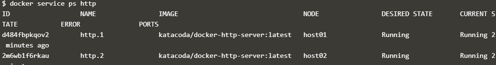

# Menginisialisasi Mode Swarm

## Langkah 1 - Menginisialisasi Mode Swarm
Ubah satu host, host Docker menjadi Mode Swarm Docker Multi-host. Menjadi Manajer Secara default, Docker berfungsi sebagai node-tunggal yang terisolasi. Semua kontainer hanya dikerahkan ke mesin. Mode Swarm mengubahnya menjadi mesin multi-host cluster-aware.

Yang paling penting adalah bagaimana menginisialisasi Mode Swarm. Inisialisasi dilakukan melalui init.

## Langkah 2 - Bergabung dengan Cluster
Dengan Mode Swarm diaktifkan, dimungkinkan untuk menambahkan node tambahan dan mengeluarkan perintah di semuanya. 

Tugas pertama adalah untuk mendapatkan token yang diperlukan untuk menambah pekerja ke cluster.

Pada host kedua, bergabunglah dengan cluster dengan meminta akses melalui manajer. Token diberikan sebagai parameter tambahan.

Secara default, manajer akan secara otomatis menerima node baru yang ditambahkan ke cluster. 

## Langkah 3 - Buat Overlay Network
Mode Swarm juga memperkenalkan model jaringan yang ditingkatkan. Dalam versi sebelumnya, Docker mengharuskan penggunaan penyimpanan nilai kunci eksternal, seperti Konsul, untuk memastikan konsistensi di seluruh jaringan.

Perintah berikut akan membuat jaringan overlay baru yang disebut skynet.

## Langkah 4 - Menyebarkan Layanan

Secara default, Docker menggunakan model replikasi penyebaran untuk memutuskan wadah mana yang harus dijalankan pada host mana. Pendekatan penyebaran memastikan bahwa kontainer digunakan di seluruh cluster secara merata.

Dalam hal ini, kami sedang memasang Docker Image katacoda / docker-http-server. Kami mendefinisikan nama layanan yang disebut http dan itu harus dilampirkan ke jaringan skynet yang baru dibuat.

Daftar kontainer pada host dengan mengetikkan `docker ps`

Daftar kontainer pada host kedua dengan mengetikkan `docker ps`

Jika kami mengeluarkan permintaan HTTP ke port publik, itu akan diproses oleh dua container dengan mengetikkan `curl docker`

## Langkah 5 - Periksa Status
Konsep Layanan memungkinkan Anda untuk memeriksa kesehatan dan keadaan cluster Anda dan aplikasi yang berjalan.

Daftar semua tugas yang terkait dengan layanan di seluruh cluster. Dalam hal ini, setiap tugas adalah sebuah wadah

Melihat detail dan konfigurasi layanan melalui perintah `docker service inspect --pretty http`

Di setiap node, Anda dapat menanyakan tugas apa yang sedang dijalankan. Cukup mengacu pada Pemimpin simpul manajer dengan perintah `docekr node ps self`

Dengan menggunakan ID suatu node, Anda dapat meminta host secara individu

## Langkah 6 - Skala Layanan
Layanan memungkinkan kami untuk mengukur berapa banyak contoh tugas yang berjalan di seluruh cluster.

Saat ini, kami memiliki dua kontainer yang berjalan seimbang, yang memproses permintaan.

Perintah di bawah ini akan meningkatkan skala layanan http kami untuk berjalan di lima kontainer.

Pada setiap host, Anda akan melihat node tambahan dimulai dengan perintah `docker ps`

Penyeimbang beban akan secara otomatis diperbarui. Permintaan sekarang akan diproses di wadah baru. Cobalah mengeluarkan lebih banyak perintah melalui perintah `curl docker`

# Orkestrasi menggunakan Susunan Docker

## Langkah 1 - Menentukan Kontainer Pertama

Docker Compose didasarkan pada file docker-compose.yml. File ini mendefinisikan semua kontainer dan pengaturan yang Anda butuhkan untuk meluncurkan kumpulan cluster Anda.

Salin yaml berikut ke editor. Ini akan mendefinisikan wadah yang disebut web, yang didasarkan pada pembangunan direktori saat ini.

## Langkah 2 - Menentukan Pengaturan
Docker Compose mendukung semua properti yang dapat didefinisikan menggunakan buruh pelabuhan.

## Langkah 3 - Mendefinisikan Kontainer Kedua
Pada langkah sebelumnya, kami menggunakan Dockerfile di direktori saat ini sebagai dasar untuk wadah.

Tentukan wadah kedua dengan nama redis yang menggunakan gambar redis. Mengikuti format YAML, detail wadahnya adalah:

## Langkah 4 - Docker Up
Dengan file docker-compose.yml dibuat di tempat, Anda dapat meluncurkan semua aplikasi dengan satu perintah ke atas. Jika Anda ingin memunculkan satu wadah, maka Anda dapat menggunakan <nama>.

Luncurkan aplikasi Anda menggunakan

## Langkah 5 - Manajemen Docker
Docker Compose tidak hanya dapat mengelola wadah awal tetapi juga menyediakan cara mengelola semua wadah menggunakan satu perintah.

Untuk mengakses semua log melalui aliran tunggal yang Anda gunakan

Perintah lain mengikuti pola yang sama. Temukan mereka dengan mengetik

## Langkah 6 - Skala Docker
Karena Docker Compose memahami cara meluncurkan wadah aplikasi Anda, itu juga dapat digunakan untuk mengukur jumlah kontainer yang berjalan.

Skala jumlah wadah web yang Anda jalankan menggunakan perintah

## Langkah 7 - Docker Stop
Seperti ketika kami meluncurkan aplikasi, untuk menghentikan satu set wadah Anda dapat menggunakan perintah

Untuk menghapus semua wadah gunakan perintah

