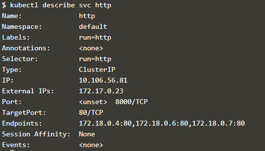

# Kubernetes

Kita mulai kita perlu meluncurkan cluster Kubernetes.
Jalankan perintah di bawah ini untuk memulai komponen kluster dan unduh Kubectl CLI.

Tunggu sampai Node menjadi Siap dengan memeriksa

## Langkah 2 - Jalankan Kubectl
Perintah jalankan membuat penyebaran berdasarkan parameter yang ditentukan, seperti gambar atau replika. Penempatan ini dikeluarkan untuk master Kubernetes yang meluncurkan Pods dan kontainer yang diperlukan. Kubectl run_ mirip dengan docker run tetapi pada level cluster.

Format perintahnya adalah kubectl menjalankan <name of deployment> <properties>

Perintah berikut akan meluncurkan penyebaran yang disebut http yang akan memulai sebuah wadah berdasarkan Docker Image katacoda / docker-http-server: terbaru.

Kemudian dapat menggunakan kubectl untuk melihat status penyebaran

Untuk mencari tahu apa yang dibuat Kubernetes, Anda bisa mendeskripsikan proses penyebaran.

## Langkah 3 - Kubectl Expose
Dengan penyebaran yang dibuat, kita dapat menggunakan kubectl untuk membuat layanan yang memaparkan Pods pada port tertentu.

Gunakan perintah berikut untuk mengekspos port kontainer 80 pada host 8000 yang mengikat ip eksternal host.

kemudian dapat melakukan ping host dan melihat hasilnya dari layanan HTTP.

## Langkah 4 - Jalankan Kubectl dan Ekspos
Dengan menjalankan kubectl dimungkinkan untuk membuat penyebaran dan mengeksposnya sebagai satu perintah.

Gunakan perintah perintah untuk membuat layanan http kedua yang terbuka di port 8001.

mengaksesnya menggunakan

Untuk menemukan detail yang bisa di gunakan

## Langkah 5 - Skala Kontainer
Dengan menjalankan penyebaran kami, kami sekarang dapat menggunakan kubectl untuk mengukur jumlah replika.

Skala perintah kubectl memungkinkan kita untuk menyesuaikan jumlah Pods yang berjalan untuk pengendali penempatan atau replikasi tertentu.

Mendaftar semua pod, Anda akan melihat tiga berjalan untuk penyebaran http

Setelah setiap Pod dimulai, ia akan ditambahkan ke layanan penyeimbang beban. Dengan menjelaskan layanan, Anda dapat melihat titik akhir dan Pod terkait yang disertakan.

# Membuat permintaan ke layanan akan meminta di beberapa node memproses permintaan tersebut.

# Langkah 1 - Buat Penempatan
Salah satu objek Kubernetes yang paling umum adalah objek penyebaran.

Salin definisi berikut ke editor.

Ini digunakan untuk cluster dengan perintah

Karena ini adalah objek Penerapan, daftar semua objek yang digunakan dapat diperoleh melalui

## Langkah 2 - Buat Layanan
Kubernetes memiliki kemampuan jaringan yang kuat yang mengontrol cara aplikasi berkomunikasi. Konfigurasi jaringan ini juga dapat dikontrol melalui YAML

Salin definisi Layanan ke editor. 

Menyebarkan Layanan dengan

Seperti sebelumnya, detail semua objek Layanan yang digunakan dengan perintah `kubectl get svc`

Dengan menjelaskan objek, Anda dapat menemukan detail lebih lanjut tentang konfigurasi dengan perintah `kubectl describe svc webapp-svc`

## Langkah 3 - Skala Penempatan
Rincian YAML dapat diubah karena konfigurasi yang berbeda diperlukan untuk penerapan. Ini mengikuti infrastruktur sebagai pola pikir kode.

Pembaruan definisi yang ada diterapkan menggunakan kubectl apply. Untuk skala jumlah replika, gunakan file YAML yang diperbarui menggunakan

Seketika, keadaan yang diinginkan dari kluster kami telah diperbarui, dapat dilihat dengan

Pod tambahan akan dijadwalkan agar sesuai dengan permintaan.

Mengeluarkan permintaan ke pelabuhan akan menghasilkan berbagai wadah memproses permintaan
